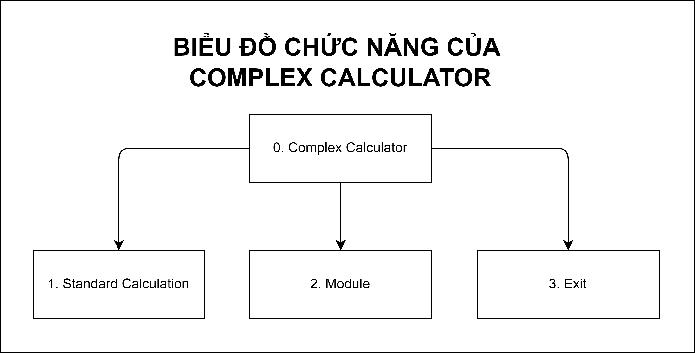
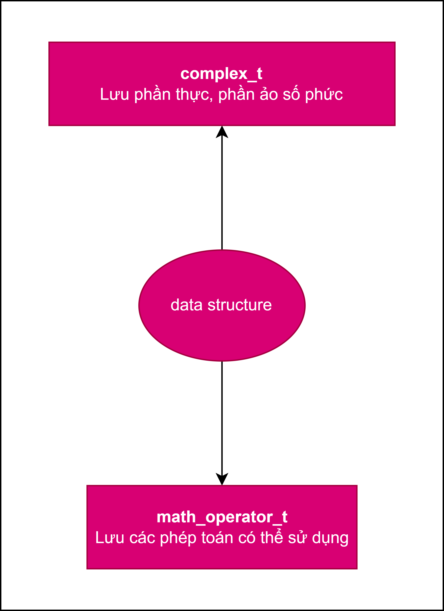
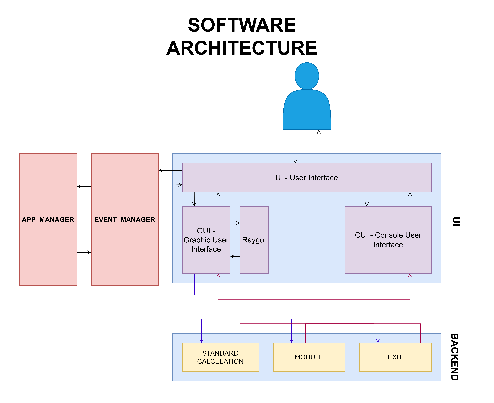
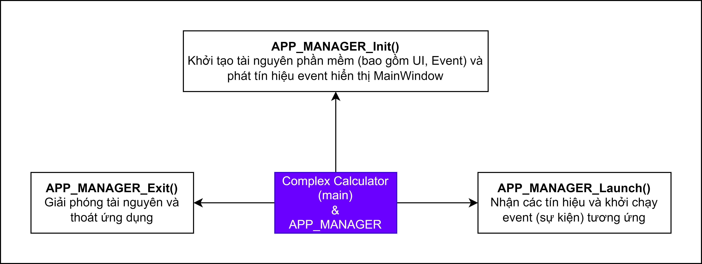
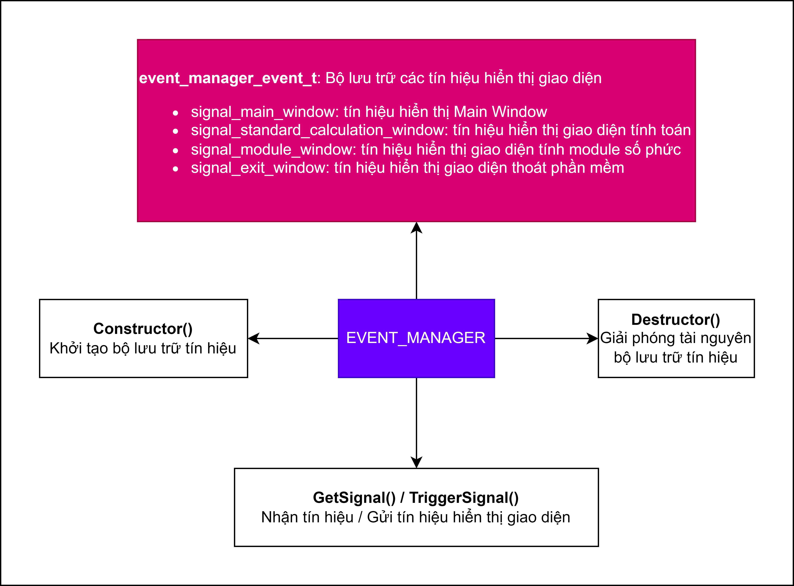
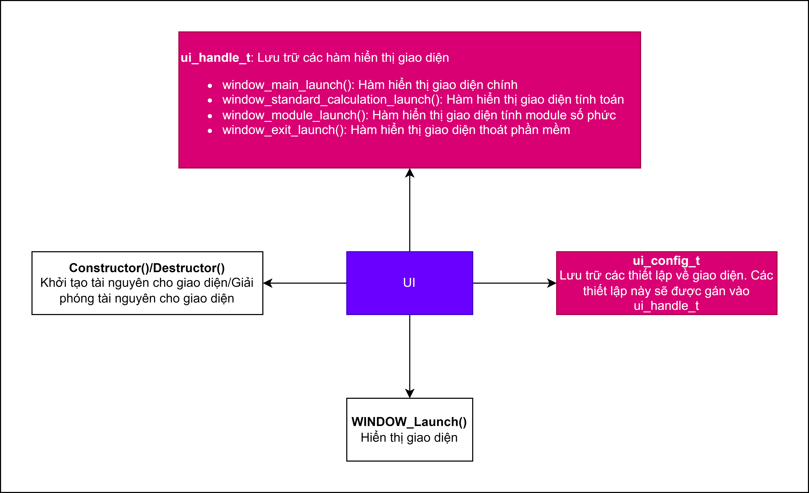
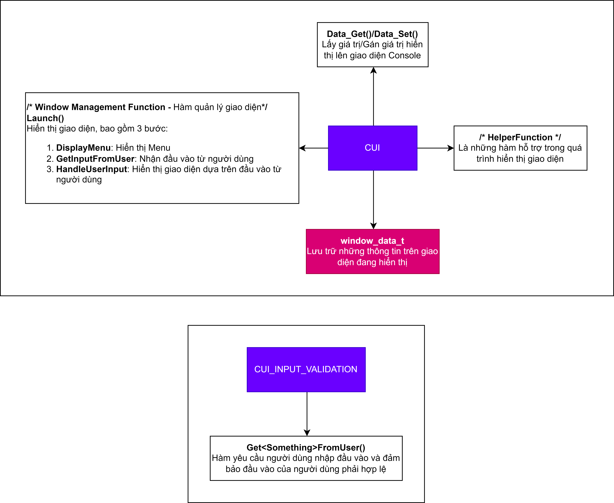
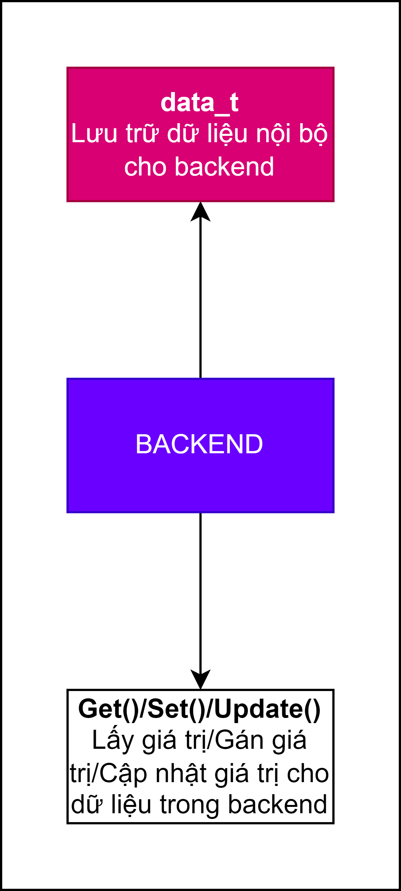
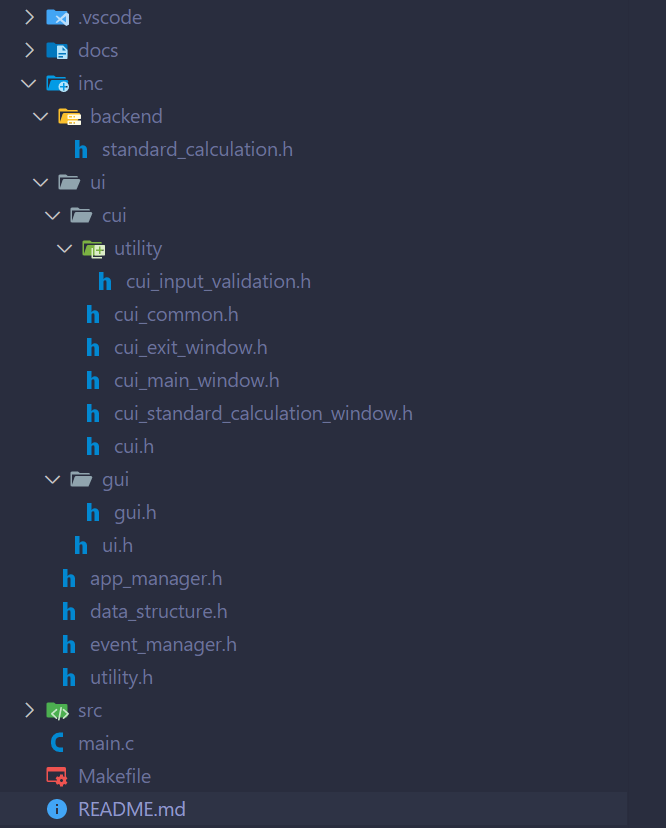

# COMPLEX CALCULATOR

## **1. Mô tả thiết kế phần mềm**

Phần mềm Complex Calculator là một máy tính số phức với các chức năng cơ bản bao gồm: 

1. **Standard Calculation**: Thực hiện các phép tính cơ bản như cộng, trừ, nhân, chia.
2. **Module**: Tính toán module của số phức.
3. **Exit**: Thoát khỏi chương trình.





## **2. Kiến trúc hệ thống**



Hệ thống Complex Calculator được thiết kế với các khối chức năng chính sau:

### **2.1. APP_MANAGER**

Khối APP_MANAGER quản lý toàn bộ phần mềm và bao gồm 3 bước chính:

- **`Init()` - Khởi tạo**: Bước khởi tạo các thành phần của phần mềm.
- **`Launch()` - Chạy**: Quản lý việc chạy ứng dụng và xử lý các sự kiện từ người dùng.
- **`Exit()` - Thoát**: Thực hiện thoát khỏi chương trình.



### **2.2 EVENT_MANAGER**

Khối EVENT_MANAGER tạo và nhận tín hiệu để hiển thị giao diện tương ứng với 4 sự kiện:

- **main window**: Sự kiện hiển thị giao diện chính.
- **standard calculation window**: Sự kiện hiển thị giao diện tính toán cơ bản.
- **module window**: Sự kiện hiển thị giao diện tính toán module.
- **exit window**: Sự kiện hiển thị giao diện thoát.



### **2.3. UI**

Khối UI bao gồm Command-line User Interface (CUI) và Graphical User Interface (GUI). 

> Khối UI được thiết kế bao gồm 4 giao diện: ***MainWindow***, ***StandardCalculationWindow***, ***ModuleWindow*** và ***ExitWindow***


- **CUI**: Giao diện dòng lệnh bao gồm 4 giao diện con. Mỗi giao diện con bao gồm 2 phần:
  - **Data**: Lưu trữ dữ liệu của giao diện đó.
  - **Window Management Function**: Các hàm khởi chạy giao diện, bao gồm 3 hàm `DisplayMenu()`, `GetInputFromUser()` và `HandleUserInput()`, được đóng gói thành một hàm duy nhất `Launch()`.

- **GUI** (Các học viên tự luyện): Giao diện đồ họa bao gồm 4 giao diện con. Mỗi giao diện con bao gồm 2 phần:
  - **Data**: Lưu trữ dữ liệu của giao diện đó.
  - **Window Management Function**: Các hàm khởi chạy giao diện, bao gồm nhiều hàm được đóng gói thành một hàm duy nhất `Launch()`.

***Người dùng có thể lựa chọn sử dụng giao diện CUI hoặc GUI.***



### **2.4. BACKEND**

Khối BACKEND bao gồm backend cho chức năng Standard Calculation và Module:

- **Standard Calculation**: Bao gồm 2 phần:
  - **Data**: Lưu trữ dữ liệu cho phần xử lý tính toán cơ bản.
  - **Backend Processing Function**: Các hàm xử lý tính toán.

- **Module**: Bao gồm 2 phần:
  - **Data**: Lưu trữ dữ liệu cho phần xử lý tính toán module.
  - **Backend Processing Function**: Các hàm xử lý tính toán.



## **3. Cấu trúc dự án**

Dưới đây là cây thư mục dự án hiện tại:



Thư mục ".vscode" chứa các file đã cấu hình sẵn IntelliSense Visual Studio Code. Ngoài ra, các file còn lại được chia thành các nhóm chức năng sau:

**Thư mục gốc**

* `docs`: Chứa tài liệu liên quan tới dự án.
* `inc`/`src`: Chứa các file khai báo hàm/mã nguồn cho Complex Calculator
    * `main.c`: Chứa nơi bắt đầu khởi chạy phần mềm.
    * `app_manager.h/.c`: Chứa mã nguồn về trình tự khởi chạy của phần mềm.
    * `event_manager.h/.c`: Chứa mã nguồn về các sự kiện quyết định giao diện nào sẽ được hiển thị
    * `data_structure.h`: Các cấu trúc dữ liệu của Complex Calculator
    * `utility.h`: Các tiện ích cho việc lập trình, ở đây chứa tiện ích `LOG()` dùng để in ra màn hình console nhằm dễ dàng trong quá trình gỡ lỗi.
    * `backend`: Chứa mã nguồn cho phần lõi của Complex Calculator.
        * `standard_calculation.h/.c`: Chứa các định nghĩa cho các hàm tính toán cơ bản.
    * `ui`: Chứa các file liên quan đến giao diện. Các giao diện này hoàn toàn độc lập với chức năng (backend) của hệ thống.
        * `cui`: Chứa các định nghĩa cho giao diện người dùng console.
            * `utility`: Chứa các định nghĩa cho các tiện ích giao diện người dùng.
                * `cui_input_validation.h/.c`: Chứa các định nghĩa cho các hàm yêu cầu đầu vào người dùng từ console.
            * `cui.h`: Tổng hợp toàn bộ các file cần thiết cho CUI, các module khác chỉ cần `#include "cui.h"`.
            * `cui_common.h`: Chứa các định nghĩa cho các cấu trúc dữ liệu và khai báo hàm chung của giao diện console.
            * `cui_main_window.h/.c`: Chứa các định nghĩa cho cửa sổ chính của giao diện người dùng console.
            * `cui_standard_calculation_window.h/.c`: Chứa các định nghĩa cho cửa sổ tính toán cơ bản của giao diện người dùng console.
            * `cui_exit_window.h/.c`: Chứa các định nghĩa cho cửa sổ thoát giao diện người dùng console.
        * `gui`: Chứa các định nghĩa cho giao diện người dùng đồ họa.
            * `gui.h`: Chứa các định nghĩa cho giao diện người dùng đồ họa.
* `Makefile`: Chứa lệnh biên dịch và chạy Complex Calculator
* `README.md`: Mô tả dự án.

**Lưu ý**

* Các file header có phần mở rộng `.h` thường chứa các **khai báo** cho các cấu trúc dữ liệu, hàm.
* Các file nguồn có phần mở rộng `.c` thường chứa **định nghĩa/khởi tạo** cho các hàm, biến.
* Tệp Makefile được sử dụng để tự động hóa việc biên dịch và chạy phần mềm.

## **4. Hướng dẫn chạy dự án**
- `cd` tới thư mục dự án (thư mục Revision)

- Chạy với Make:
    ```
    make clean build run
    ```
**Lưu ý:**
- Nếu chỉ muốn xóa thư mục build: `make clean`
- Nếu chỉ muốn biên dịch: `make build`
- Nếu chỉ muốn chạy: `make run`

